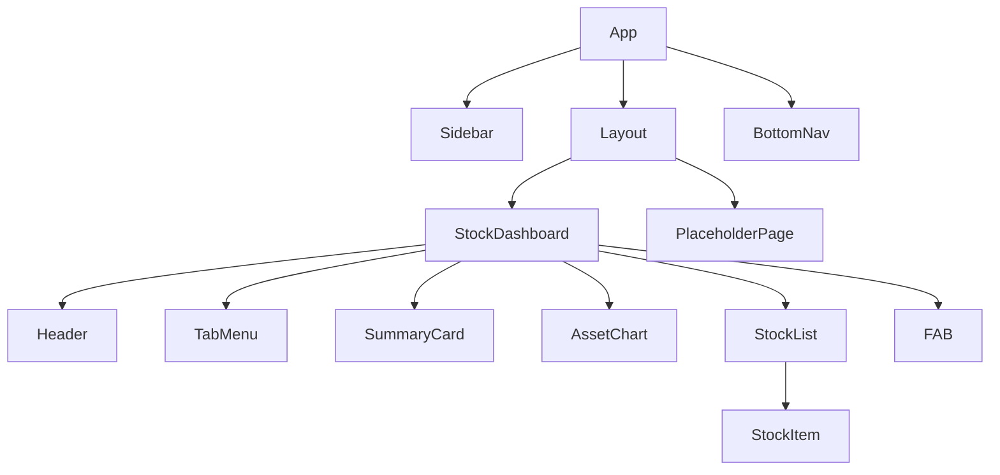

# MyHomeFin Project Guide

이 문서는 **MyHomeFin** 프로젝트의 구조, 아키텍처, 주요 기능 및 수정 방법을 설명합니다. 이 가이드를 통해 프로젝트를 이해하고 원하는 대로 기능을 확장하거나 수정할 수 있습니다.

## 1. 프로젝트 개요

**MyHomeFin**은 개인 자산(주식, 부동산, 예금 등)을 관리하는 웹 애플리케이션입니다.
- **디자인 컨셉**: 토스(Toss) 스타일의 깔끔하고 직관적인 UI
- **기술 스택**: React, TypeScript, Tailwind CSS, Vite, Recharts
- **주요 기능**:
    - 반응형 디자인 (모바일/데스크탑 지원)
    - 주식 포트폴리오 관리 (국내/해외)
    - 환율 계산 및 통화 전환 (KRW/USD)
    - 자산 추이 차트 시각화

## 2. 디렉토리 구조

```
src/
├── components/         # 모든 UI 컴포넌트가 위치합니다.
│   ├── Layout.tsx      # 전체 레이아웃 (반응형 컨테이너)
│   ├── Sidebar.tsx     # 데스크탑용 사이드바 메뉴
│   ├── BottomNav.tsx   # 모바일용 하단 네비게이션
│   ├── StockDashboard.tsx # 주식 모듈의 메인 화면 (핵심 로직 포함)
│   ├── ...             # 기타 UI 컴포넌트들
├── data/
│   └── mockData.ts     # 테스트용 가짜 데이터 (주식 목록, 자산 추이 등)
├── types/
│   └── index.ts        # TypeScript 타입 정의 (Stock, AssetHistory 등)
├── App.tsx             # 앱의 진입점, 라우팅 및 전역 상태 관리
└── main.tsx            # React 렌더링 진입점
```

## 3. 아키텍처 및 데이터 흐름

### 3.1. 컴포넌트 계층 구조



### 3.2. 상태 관리 (State Management)

이 앱은 복잡한 상태 관리 라이브러리(Redux 등) 대신 React의 `useState`와 `props`를 사용하여 데이터를 관리합니다.

1.  **전역 상태 (`App.tsx`)**:
    -   `activeModule`: 현재 활성화된 메뉴 (예: 'stocks', 'real-estate')를 관리합니다. 이 상태에 따라 메인 화면에 어떤 컴포넌트를 보여줄지 결정합니다.

2.  **주식 모듈 상태 (`StockDashboard.tsx`)**:
    -   `activeTab`: '국내 주식' vs '해외 주식' 탭 전환
    -   `exchangeRate`: 환율 (기본값 1400원)
    -   `currencyMode`: 표시 통화 ('KRW' vs 'USD')

### 3.3. 반응형 전략

-   **모바일 우선 (Mobile First)**: 기본 스타일은 모바일에 최적화되어 있습니다.
-   **데스크탑 확장**: `md:` (768px 이상) 브레이크포인트를 사용하여 데스크탑 레이아웃을 적용합니다.
    -   **네비게이션**: 모바일은 `BottomNav`, 데스크탑은 `Sidebar`를 사용합니다.
    -   **레이아웃**: 데스크탑에서는 `Sidebar` 공간만큼 왼쪽 여백(`pl-64`)을 주고, 콘텐츠 폭을 제한(`max-w-4xl`)하여 가독성을 높입니다.

## 4. 주요 기능 구현 상세

### 4.1. 환율 및 통화 변환 로직

해외 주식의 경우, 달러(USD) 기반 데이터를 원화(KRW)로 보여주거나 그 반대로 보여주는 기능이 핵심입니다.

-   **데이터 원본**: `mockData.ts`에 정의된 주식 데이터는 각자의 `currency` 속성('KRW' 또는 'USD')을 가집니다.
-   **계산 로직 (`StockDashboard.tsx`)**:
    1.  모든 계산(총 자산, 손익)은 먼저 **원화(KRW)** 기준으로 통일하여 계산합니다. (USD 주식은 환율을 곱함)
    2.  사용자가 USD 보기를 선택하면, 최종 계산된 원화 값을 환율로 나누어 보여줍니다.
-   **개별 아이템 표시 (`StockItem.tsx`)**:
    -   각 주식 아이템도 현재 설정된 `currencyMode`와 자신의 `currency`를 비교하여 적절히 변환된 가격을 표시합니다.

## 5. 수정 및 확장 가이드

### 5.1. 새로운 메뉴 추가하기

1.  **`Sidebar.tsx` 수정**: `menuItems` 배열에 새로운 메뉴 객체(id, label, icon)를 추가합니다.
2.  **`BottomNav.tsx` 수정**: 모바일에도 표시하려면 `mainItems` 배열에 추가합니다. (공간 제약 주의)
3.  **`App.tsx` 수정**: `renderContent` 함수의 `switch` 문에 새로운 `case`를 추가하여 해당 메뉴 선택 시 보여줄 컴포넌트를 연결합니다.

### 5.2. 새로운 주식 데이터 추가하기

1.  **`src/data/mockData.ts` 열기**
2.  `domesticStocks` (국내) 또는 `overseasStocks` (해외) 배열에 새로운 객체를 추가합니다.
    ```typescript
    {
      id: 'new-stock',
      name: '새로운 주식',
      ticker: 'NEW',
      currentPrice: 50000,
      currency: 'KRW',
      quantity: 10,
      avgPrice: 45000,
      changeRate: 3.5
    }
    ```

### 5.3. 색상 및 스타일 변경하기

이 프로젝트는 **Tailwind CSS**를 사용합니다. 클래스 이름을 변경하여 스타일을 쉽게 수정할 수 있습니다.

-   **테마 색상**: 주로 `blue-600` (브랜드 컬러), `red-500` (수익), `blue-500` (손실)을 사용합니다.
-   **배경색**: `bg-[#F2F4F6]` (앱 배경), `bg-white` (카드 배경) 등을 사용합니다.

## 6. 개발 및 빌드

-   **개발 서버 실행**: `npm run dev`
-   **프로젝트 빌드**: `npm run build`
-   **미리보기**: `npm run preview`
